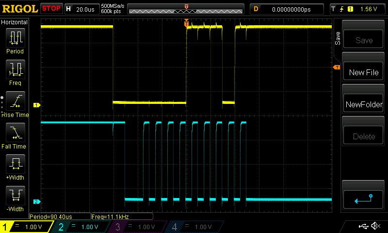

# CPE 1040 - Introduction to Computer Engineering
# Assignment 8

## Visualize Simple Continuous Signals: 
#### The following signals were visualized, using the Auto regime and default settings (trigger on a rising edge on CH1):

#### a. Configured the OUT of the built-in function generator on the workstation. 
   
   Video URL:  https://imgur.com/gallery/n9Zj0Kd

#### b. Configured the standalone Rigol function generator properly onto the oscilloscope.
   
   Video URL: https://imgur.com/gallery/HaW4E5u
   
#### c. Wrote a one-line micro:bit program to set an analog pin to emit PWM pulses.

   Link to code file: [Here](pwm-pulses.js)
   
   Video URL: https://imgur.com/gallery/NOSbxNj
   
#### d. Wrote a loop that varies the duty cycle, up and down, between 5% and 95%, in steps of 5%.

   Link to code file: [Here](cycle-5-percent.js)
   
   Video URL: https://imgur.com/gallery/KbkGT4m

#### e. Explored the other servo function, using the oscilloscope, and wrote a small program to demo the operation. 

   Link to code file: [Here](other-servo.js)
   
   Video URL: https://imgur.com/gallery/RSmr2Qx
   
## I2C Warmup:
1Q. What are the disadvantages of the other two serial communication channels, UART and SPI, and how does I2C improve on them?

#### 1A: I2C is intended to allow multiple "slave" chips to interact/communicate with one or more "master" chips (allowing more than one master to communicate with all devices on the bus). I2C is only intended for short distance communications within a single device, and it only requires two signal wires (which can support up to 1008 slave devices) to exchange information. By comparison, in software, the UART is more complex to implement accurately. Most UART devices only support a certain set of fixed baud rates (the highest usually being around 230400 bits/second). A disadvantage for SPI is the number of pins required to connect an individual master to an individual slave with an SPI bus requires four lines. Adding an additional slave will require one additional chip select I/O pin on the master. Large amounts of connections could possibly lead up to trouble or confusion.

2Q. I2C is a two-wire serial communication channel. What are the two wires, SDA and SCL?

#### 2A: Each I2C bus consists of two signals: SCL and SDA. The SDA is the data signal (information being transmitted), and the SCL is the clock signal. The clock signal is always generated by the current bus master.

3Q. What distinguishes the master and the slaves?

#### 3A: The master can initiate the transfer over the I2C bus, but the slaves cannot. The master also drives the clock. The clock signal is always generated by the current bus master but some slave devices can force the clock low at times. This is to delay the master sending more data (or to prolong time to prepare data before the master attempts to clock it out). This is usually referred to as clock stretching.

4Q. How are the two types of protocol frames different?

#### 4A: Two types of protocol frames: the address frame, and the data frame. The address frame (first in any new communication sequence) is where the master points out the slave to which the message is being sent. Data begins being transmitted, after the address frame has been sent out. Data frames (one or more) are messages (8-bit data) passed from master to slave, or slave to master. Data is placed on the SDA line after SCL goes low, and sampled after the SCL line goes high. The address frame 

5Q. What is the most appropriate trigger for capturing an I2C frame on the oscilloscope?

#### 5A: The most appropriate trigger for capturing an I2C frame on the oscilloscope is on the falling edge of the SDA. The SDA leads with a falling edge; and the data frame starts after the address frame and so will the SCL. In regular data writing conditions, the value on SDA should stay the same when SCL is high, to avoid false stop conditions.

6Q. (Advanced) If the micro:bit is configured by default as a master, and two micro:bits, connected to each other via the SDA and SCL lines, communicate over I2C? (Bonus for a convincing argument, one way or another.)

#### 6A: Both micro:bits will be configured by default as a master. Two masters could communicate with other slaves at respected intervals, but cannot communicate at same time (on same bus) to slaves or each other. Both masters will not initiate/sync transmission data at the same time, which will lead to issues. Moreover, to transmit the slave address, in a normal 7-bit transfer, another transfer begins immediately, and this transfer contains bits 7:0 of the address. The addressed slave should then respond with an ACK bit.

## First Steps with I2C:
#### 1. In a loop, configured the micro:bit to write a number to some arbitrary I2C address. Then, captured an I2C frame on the oscilloscope (Picture below).
   
   1Q. What frame did you capture?
    
   #### 1A: The address frame was captured. Which can be identified by the first falling edge of the SDA signal.
   
   2Q. What does the I2C write function do when there is nothing connected?
    
   #### 2A: In normal eyes nothing, however deep down the master will try to initiate a transfer, but the slave will not provide confirming feedback, and so the master will stop transmission.
    
   3Q. Is there a difference in what you capture if you write a number to one of the internal device addresses?
    
   #### 3A: There is a difference in what you capture, because one writes to an acutal internal device address, which will receive feedback from the slave, and thus an address frame and a data frame. On the other hand, for a non-internal device address (arbitrary address) there is no slave feedback, just a data frame. 

Link to code file: [Here](arbitrary-address.js)
    
(1)Picture of Oscilloscope Display: 

(1)Picture of Setup: 

    
#### 2. Wrote a short program to read a number from the I2C devices on the micro:bit. For each device:

   a. Try all three addresses. (Bonus for a cogent argument about why there are three.)
    
   #### There is basically one address for each device: 0x19 for the accelerometer, and 0x1E for the magnetometer. But two more addresses are displayed (0x32/0x33 with the Accelerometer) and (0x3C/0x3D with the Magnetometer) because these are added at the end, to either respectively write or read to that address, they are added in binary.
    
   b. Try signed and unsigned single byte integers.
    
   #### Displayed Below
      
   c. Scroll the values on the LED matrix.
    
   #### Displayed Below

#### (Address) Accelerometer:

#### Unsigned:
      
         Q: What values do you read?
         
         A: The value 128 appears to be read/displayed.
    
         Q: Can you get different values by moving the micro:bit around?
         
         A: No, I did not get different values by moving the micro:bit around.
      
   Link to code file: [Here](accelerometer-unsigned.js)
         
   Video URL: https://imgur.com/gallery/KfYUEAf
         
   Oscilloscope Display: 
   
#### Signed:
      
         Q: What values do you read?
         
         A: The value -128 appears to be read/displayed.
    
         Q: Can you get different values by moving the micro:bit around?
         
         A: No, I did not get different values by moving the micro:bit around.
   
   Link to code file: [Here](accelerometer-signed.js)
         
   Video URL: https://imgur.com/gallery/JK22Uvj
         
   Oscilloscope Display: 
   

#### (Address) Magnetometer:

#### Unsigned:
      
         Q: What values do you read?
         
         A: A lot of different positive numbers where read/displayed, which constantly changed.
    
         Q: Can you get different values by moving the micro:bit around?
         
         A: Yes, I did get different values by moving the micro:bit around.
   
   Link to code file: [Here](magnetometer-unsigned.js)
         
   Video URL: https://imgur.com/gallery/iXi7dsY
         
   Oscilloscope Display: 
   
#### Signed:
      
         Q: What values do you read?
         
         A: A lot of different numbers where read/displayed, which constantly changed. Including some positives but mostly negatives.
    
         Q: Can you get different values by moving the micro:bit around?
         
         A: Yes, I did get different values by moving the micro:bit around.
   
   Link to code file: [Here](magnetometer-signed.js)
         
   Video URL: https://imgur.com/gallery/mBPBcoF
         
   Oscilloscope Display:
